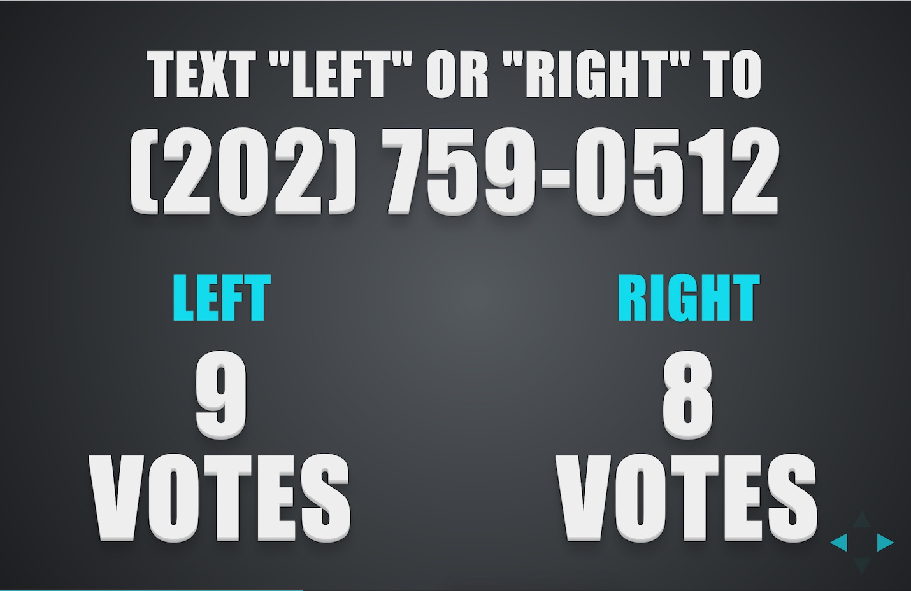
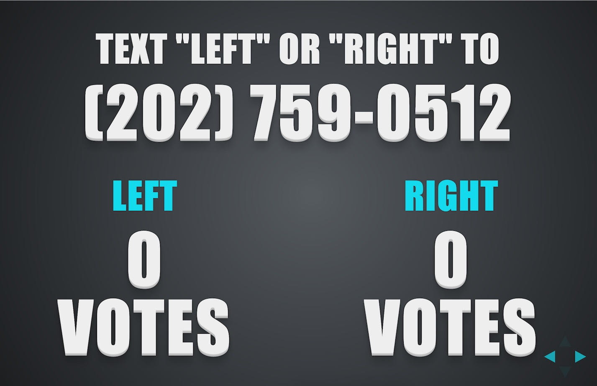
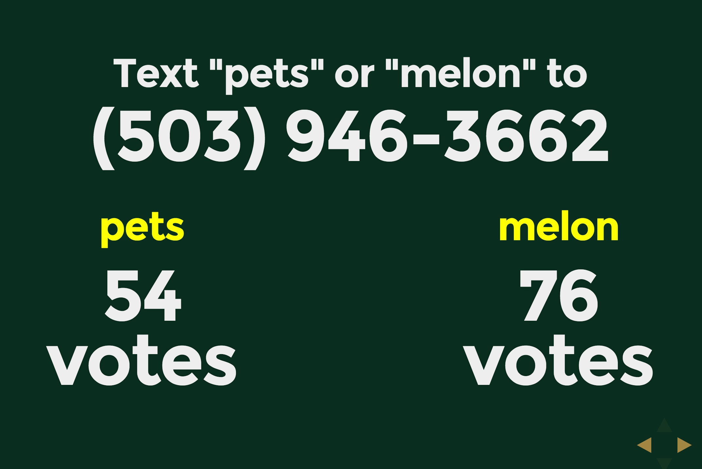

# Choose Your Own Adventure Presentations
Use this code to create real-time branching presentations so 
audiences can choose the path through your next technical talk.

Here's a screenshot of the vanilla choices screen. You can of course modify
this initial screen with your own styles and visualizations.

The screenshot may not look like much at first. That's where your story and
content come in. To see the potential of audience voting during a presentation
to determine the path of the story, check out the "see it in action" section
below.

## Code walkthrough
Detailed installation instructions and a walkthrough of the code base
can be found in 
[this blog post I wrote for Twilio](https://www.twilio.com/blog/2014/11/choose-your-own-adventure-presentations-with-reveal-js-python-and-websockets.html)
along with the follow-up three part tutorial:

1. [Wizards Only](https://www.twilio.com/blog/2015/03/choose-your-own-adventures-presentations-wizard-mode-part-1-of-3.html)
1. [Even Wizards Need Web Forms](https://www.twilio.com/blog/2015/05/choose-your-own-adventure-presentations-wizard-mode-part-2-of-3.html)
1. Voting with a Wand (or Smartphone) (coming soon)

## See it in action
You can check out how
these branching presentations work if you watch the DjangoCon 2014 video 
"[Choose Your Own Django Deployment Adventure](https://www.youtube.com/watch?v=QrFEKghISEI)" 
or 
"[Choose Your Own WSGI Deployment Adventure](https://www.youtube.com/watch?v=R-YvQ_YvzA4)"
with [Matt Makai](https://twitter.com/mattmakai) and 
[Kate Heddleston](https://twitter.com/heddle317). 

Here's how the screen looks initially.

After votes start coming in...

Here's an example screenshot I took from the DjangoCon talk with DjangoCon
styling.

## Software stack
Uses 
[reveal.js](http://lab.hakim.se/reveal-js/#/), 
[Python](https://www.python.org/), 
[Flask](http://flask.pocoo.org/), 
[WebSockets](http://en.wikipedia.org/wiki/WebSocket),
[Flask-SocketIO](https://flask-socketio.readthedocs.org/en/latest/) 
and [Twilio SMS](https://www.twilio.com/sms).

Yes, we used a Flask app at DjangoCon. For shame.

## Authors
Created by [Matt Makai](http://github.com/makaimc) and 
[Kate Heddleston](https://github.com/heddle317). 

This project wouldn't have been possible without 
[Miguel Grinberg](http://blog.miguelgrinberg.com/)'s fantastic 
flask-socketio library and his detailed tutorials. A huge thank you to
Miguel for his coding and writing.

